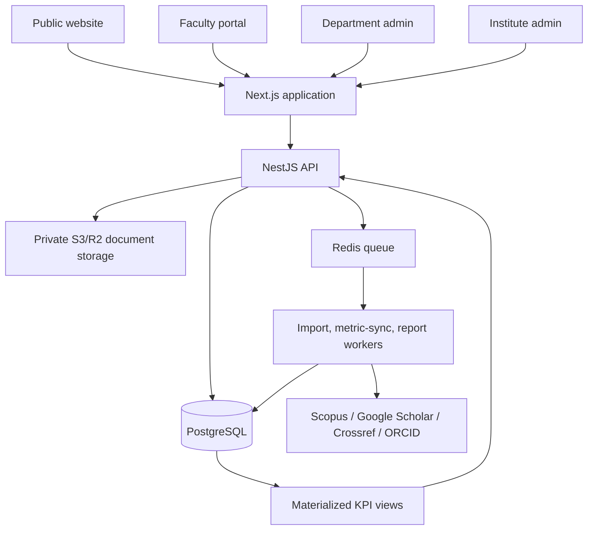

# Institute Research, Faculty & Department Portal

## 1. Product boundary

One platform serves the whole institute. Every record belongs to an **institution** and is scoped to one or more **departments**; a faculty member can also have an individual public portfolio. It replaces duplicated department websites and individual CV spreadsheets without losing department-level control.

### Public experiences

| Level | Page | Includes |
|---|---|---|
| Institute | `/` | institute KPIs, departments, research totals, top faculty, latest output |
| Department | `/departments/[slug]` | faculty, projects, funding, publications, patents, facilities and KPIs |
| Faculty | `/faculty/[slug]` | verified profile, metrics, research interests, CV and outputs |
| Research catalogue | `/research/{journals,conferences,books,book-chapters}` | separate searchable/filterable publication pages |
| Projects / patents | `/projects`, `/patents` | institute and department filters; project/patent detail pages |

The institute, department, and faculty views use the same canonical records. Counts must never be manually typed into dashboards.

## 2. Recommended architecture



Use a modular monolith initially: **Next.js + NestJS + PostgreSQL + Prisma + Redis + S3/R2**. It is substantially easier to operate than separate services, but module boundaries make a later split safe. Use PostgreSQL rather than MySQL because it gives strong full-text search, JSON validation fields, row-level security options, and materialized views for fast institute totals.

### Core modules

1. Identity & access: institute administrator, research office, department administrator, faculty, reviewer and viewer.
2. Organisation: institutes, departments/centres, programmes, faculty appointments and reporting hierarchy.
3. Faculty portfolio: profile, education, experience, expertise, links, CV export.
4. Research: publications, projects, patents, grants, consultancy, supervision and events.
5. Metrics & integrations: ORCID, Scopus, Google Scholar and Crossref identifiers plus immutable metric snapshots.
6. Workflow: draft → submitted → department verified → institute published; change requests and audit trail.
7. Reporting & analytics: dashboard KPIs, financial/academic-year reports, NAAC/NBA/NIRF exports.

## 3. Roles and record ownership

| Role | Scope | Can do |
|---|---|---|
| `INSTITUTE_ADMIN` | whole institute | departments, all records, users, integrations, final publication and reports |
| `RESEARCH_OFFICE` | whole institute | verify research, reconcile duplicate publications, metric sync and reports |
| `DEPARTMENT_ADMIN` | assigned department(s) | manage department profile, verify its faculty records, assign appointments |
| `FACULTY` | own portfolio | create/update own drafts and nominate co-authors |
| `REVIEWER` | assigned departments | review/return records only |
| `PUBLIC` | published records only | read/search/download public material |

Authorization must check the current appointment, not merely a `department_id` stored on the faculty row. This supports joint appointments, transfers and historical reporting.

## 4. Database design

All primary keys are UUIDs. Every mutable base table uses the standard audit and lifecycle columns: `created_at`, `updated_at`, `deleted_at NULL`, `created_by`, and `updated_by`; a trigger maintains `updated_at`. Workflow-capable records also use `status` and optional `published_at`. `deleted_at` replaces the earlier `archived_at` term. Immutable history tables (for example audit logs, review history, and metric snapshots) retain the audit timestamps but are append-only rather than soft-deleted.

### Organisation and identity

| Table | Essential fields / constraints |
|---|---|
| `institutions` | `id`, `name`, `slug UNIQUE`, `domain UNIQUE` |
| `departments` | `institution_id FK`, `parent_department_id FK NULL`, `name`, `slug`; `UNIQUE(institution_id, slug)` |
| `programmes` | `department_id FK`, `code`, `name`, `level`; `UNIQUE(department_id, code)` |
| `faculty` | institute identity: name, official email, employee code, photo, designation, public slug; official email and employee code are globally unique |
| `faculty_appointments` | `faculty_id`, `department_id`, designation, `is_primary`, start/end dates; at most one active primary appointment per faculty member |
| `users`, `user_roles`, `role_department_scopes` | authentication and scoped RBAC; roles are not hard-coded onto `faculty` |
| `faculty_profiles` | 1:1 extended bio, research interests, ORCID, Scopus author ID, Google Scholar ID, URLs |

### Research records

| Table | Essential fields / constraints |
|---|---|
| `publications` | title, `publication_type` enum, DOI, ISBN, venue, volume, issue, pages, publisher, published date, source URL, status |
| `publication_authors` | `publication_id`, order, displayed author name, `faculty_id NULL`, corresponding-author flag; `UNIQUE(publication_id, author_order)` |
| `publication_departments` | publication ↔ department attribution; permits interdisciplinary output |
| `patents` | title, application number, publication number, grant number, jurisdiction, patent office, type, status, filing/publication/grant dates, applicant/assignee, inventors text, document URL |
| `patent_inventors` | patent ↔ faculty plus inventor order |
| `projects` | title, project number, scheme, sponsor, status, start/end dates, total sanctioned amount, amount received, lead department, principal investigator |
| `project_members` | project ↔ faculty with role: PI/Co-PI/Investigator |
| `project_departments` | project ↔ department attribution |
| `grants` | grant instalments: project, financial year, sanction/order number, sanctioned/received/expenditure amounts and dates |
| `consultancies`, `consultancy_members` | consultancy details and participating faculty |
| `supervisions` | scholar, programme, title, status, registration/submission/award dates, supervisor links |

`publication_type` is exactly `JOURNAL`, `CONFERENCE`, `BOOK`, or `BOOK_CHAPTER` for the four requested public catalogues. Other outputs, if needed, live in a separate `other_research_outputs` table so they do not pollute these pages.

### Metrics, time, workflow and governance

| Table | Purpose |
|---|---|
| `metric_sources` | `SCOPUS`, `GOOGLE_SCHOLAR`, `CROSSREF`, `MANUAL_VERIFIED` |
| `faculty_metric_snapshots` | faculty, source, captured-at, `h_index`, citations, i10-index nullable, raw payload/checksum |
| `publication_metric_snapshots` | source-level citation count per publication and capture time |
| `academic_years` | `institution_id`, `label`, start/end date, current flag; derived automatically |
| `financial_years` | `institution_id`, `label`, start/end date, current flag; derived automatically |
| per-entity review tables | workflow history is stored in FK-backed tables such as `publication_reviews`, `project_reviews`, and `patent_reviews`; audit logs remain deliberately polymorphic |
| `audit_logs` | actor, action, entity type/id, before/after JSON, request ID/IP |
| `documents` | storage key, MIME type, size, visibility, malware scan state; research records reference it |

### Key invariants and indexes

- DOI is normalized (lowercase, URL prefix removed) and globally unique only when present. PostgreSQL permits multiple `NULL` values in a unique index; this is intentional because a missing DOI is `NULL`, never a placeholder.
- Patent application, publication and grant numbers are normalized and unique within their jurisdiction/issuer where relevant.
- `amount_received <= total_sanctioned_amount` is validated at the service layer; grant totals are checked transactionally.
- Use composite indexes on `(department_id, status)`, `(publication_type, published_on DESC)`, `(faculty_id, captured_at DESC)`, and join tables in both directions.
- Search uses a PostgreSQL generated `tsvector` across publication title, author text, departments and research interests.

## 5. Scopus and Google Scholar metrics

Do **not** keep H-index or citation values as editable columns on `faculty`. They are external, time-dependent measurements.

For each faculty profile, store source identifiers and append a snapshot after every successful sync. The public profile shows the most recent verified snapshot, its “last updated” time and source link:

| Source | Profile metrics |
|---|---|
| Scopus | H-index, citation count, Scopus Author ID |
| Google Scholar | H-index, citation count, i10-index (optional), Scholar profile ID |

Scheduled workers should run weekly for active faculty and on request for verified staff. Failed or suspicious imports go to a research-office review queue; preserve old snapshots rather than overwriting them. Verify API/licensing access before automating Scopus; Google Scholar does not provide a broadly supported official public API, so use consent-based imports or an approved provider and retain the source URL/time.

## 6. Automatic academic and financial years

The calendar is configuration, not a free-text field on every record.

- Institution settings define academic-year start month (usually July/August) and financial-year start month (April).
- A nightly job creates the next year and switches `is_current` when the configured start date arrives.
- Records store their actual event date; views derive `academic_year_id` and `financial_year_id` from those dates. Administrators can override with a required reason only when a sanction/reporting rule demands it.
- Reports use the selected year’s date range, which guarantees that institute, department and faculty totals agree.

## 7. Dashboards that calculate automatically

Use Option A: a nightly `pg_cron` job runs `REFRESH MATERIALIZED VIEW CONCURRENTLY` for KPI views. Each materialized view has a unique index solely to support concurrent refresh. An administrator may request the same refresh outside a write transaction, but writes never trigger a direct refresh because concurrent refresh cannot run inside that transaction.

- `v_faculty_kpis`: publications by type, active/completed projects, grants, patents by status, current Scopus and Scholar metrics.
- `v_department_kpis`: active faculty, output by type, funded projects, sanctioned/received amounts, patents, citations and metrics distributions.
- `v_institute_kpis`: summed department figures with de-duplication of cross-department publications/projects.

Important: institute totals count each canonical publication/project once. Department totals show attribution, so a joint CSE–ECE publication can appear in both department pages but is not double-counted at institute level.

The admin dashboard provides exception queues: missing faculty IDs, duplicate DOI/application numbers, records awaiting review, stale metrics, invalid documents, unassigned departments, and incomplete mandatory fields. This is the automation that keeps the data trustworthy—not just counters on a screen.

## 8. API and page boundaries

Use resource-oriented endpoints with filtering and a shared `scope` parameter:

```
GET /api/v1/dashboard?scope=institute|department|faculty&id=...&academicYear=...
GET /api/v1/publications?type=JOURNAL&department=...&year=...&status=PUBLISHED
POST /api/v1/publications                 # faculty draft or admin record
PATCH /api/v1/publications/:id
POST /api/v1/publications/:id/submit
POST /api/v1/publications/:id/review
GET /api/v1/faculty/:slug/portfolio
GET /api/v1/departments/:slug/overview
POST /api/v1/integrations/metrics/sync    # authorised admin/job only
```

All mutations generate audit events. Use optimistic locking (`version` number or `If-Match` header) to prevent two administrators from silently overwriting each other.

## 9. Migration from the CSE-only blueprint

1. Add `institutions`, `departments`, and `faculty_appointments`; map existing CSE faculty to a primary appointment.
2. Replace every research table’s direct `faculty_id` dependency with canonical entity + author/member join table.
3. Migrate publications, patents and projects first; normalize DOI/patent/grant identifiers and merge duplicates.
4. Add department attribution to each research record and preserve import provenance.
5. Introduce workflow and metrics snapshots, then expose public institute/department/faculty views.
6. Move department CMS content to `department_id` scope, while institute-wide announcements use `department_id = NULL`.

## 10. Decisions still required before implementation

1. Whether this is a single institute deployment or a multi-institution SaaS product. The model supports both, but branding/login rules differ.
2. Which source is authoritative for Scopus metrics and whether the institute has API access.
3. Whether faculty publications need mandatory department-admin approval before appearing publicly.
4. The institute’s official academic-year start month and which financial reporting fields (sanctioned, received, expenditure) are required.

## 11. Locked DDL decisions

These decisions are mandatory for the row/column matrix, migrations, ORM schema, seeds, and schema tests.

### Identifier and naming policy

- All base tables have a global, meaningless `id UUID PRIMARY KEY`.
- Tables use plural `snake_case`; columns, constraints, indexes, enum types, and views use `snake_case`.
- Each main human-readable identifier is tagged in the data dictionary as `GLOBALLY_UNIQUE`, `DEPT_SCOPED_UNIQUE`, or `NOT_UNIQUE` before its constraint is written.
- A field named `code` is not globally unique merely because it is readable. It is normally unique within `department_id` among non-deleted records. Known exceptions are `faculty.employee_code` and `faculty.official_email`, both globally unique.
- `students.roll_no` is unique per `(department_id, batch_year, roll_no)`, not globally. `programmes.code` and `courses.code` are unique per `(department_id, code)`.
- `departments.slug` is unique per `(institution_id, slug)`. A course URL/search slug cannot be a generated column derived from a joined department row; if a globally addressable course route is needed, persist and maintain an institution-qualified route key (for example `institution_slug/department_slug/course_code`) in application logic or a trigger.
- Any business uniqueness rule on a soft-deletable table is implemented as a partial unique index with `WHERE deleted_at IS NULL`.

### Appointment integrity

- The schema creates a partial unique index on `faculty_appointments(faculty_id)` where `is_primary = true`, `end_date IS NULL`, and `deleted_at IS NULL`. This permits historical primary appointments while preventing two departments from claiming an active primary appointment.
- If appointment date ranges may overlap, the DDL also uses a GiST exclusion constraint to prohibit overlapping primary ranges for the same faculty member. This protects against incorrectly open or overlapping date intervals.

### Lifecycle, review, and controlled values

- The audit/lifecycle boilerplate is mandatory for mutable base tables. Association tables and immutable append-only history tables are exceptions; their retention is protected by permissions and foreign keys rather than soft deletion.
- Reviews use per-entity FK-backed tables. A polymorphic `record_reviews(record_type, record_id)` table is deliberately not used because it cannot enforce referential integrity.
- `publication_type` is a PostgreSQL enum with exactly `JOURNAL`, `CONFERENCE`, `BOOK`, and `BOOK_CHAPTER`. Workflow statuses use named per-domain PostgreSQL enums or named `CHECK` constraints; no unbounded free-text `status` field is permitted. RBAC roles remain rows in the `roles` table because they are operational configuration, not a closed workflow vocabulary.

### Reporting correctness

- `v_institute_kpis` counts canonical records, not department-attribution rows. Its SQL explicitly uses `COUNT(DISTINCT publication.id)` and `COUNT(DISTINCT project.id)` (with the real relation aliases used in the final query).
- KPI materialized views refresh nightly through `pg_cron` with `CONCURRENTLY`; every one has a unique index that satisfies PostgreSQL's concurrent-refresh requirement.

### CSE migration acceptance gate

- The first PostgreSQL schema is not accepted until it can import the available `tempcsebase` CSE dataset into one seeded institution and CSE department, then satisfy the department backend's core read paths (directories, faculty portfolios, research catalogues, projects, patents, CMS content, documents, labs, equipment, placement, and reports).
- This is a transformed migration, not a blind row copy: legacy integer IDs are retained in an import mapping table or source-reference column while the target uses UUIDs; every imported faculty receives a CSE appointment and every legacy research record receives CSE department attribution.
- No legacy value may be discarded merely because the new normalized model lacks an exact field. Preserve it in an explicitly named raw/source field or import-review table until it is curated. In particular retain raw author/inventor/PI/supervisor/OIC text, legacy external media URLs, legacy document titles/types, and source row identifiers.
- The phase-one department schema includes department-scoped destinations for `about_sections`, `programmes_offered`, `qna`, `syllabus_documents`, and `calendar_documents`; generic `documents` stores document metadata and a nullable `source_url` for existing externally hosted files.
- Migration tests must assert row counts, link counts, required-field validity, duplicate/placeholder normalization, and public/backend query results against the imported CSE fixture. Known unavailable legacy course values are reported, not fabricated.
